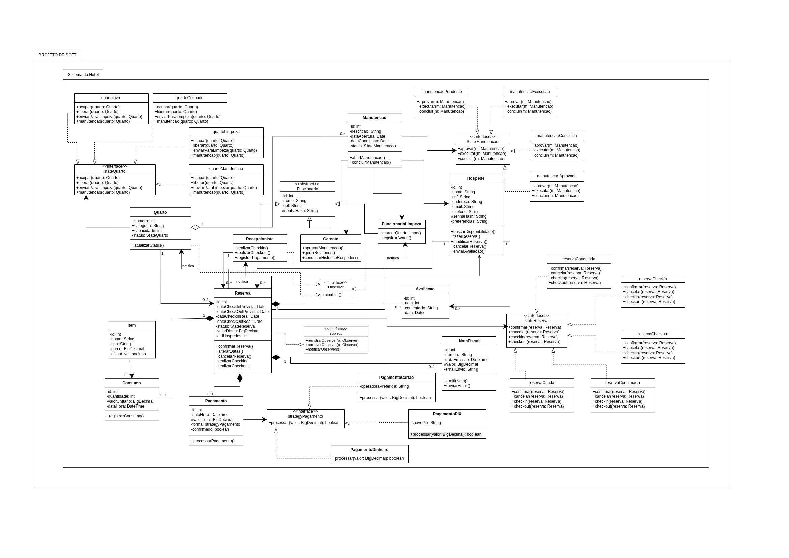

# Sistema de Hotel
> Projeto Final da disciplina de Engenharia de Software. O objetivo é gerar o esqueleto do código-fonte a partir do diagrama e desenvolver testes unitários para validar o comportamento das classes e métodos do sistema.

## Diagrama de Classes
Padrões de Projetos usados no Diagrama: Strategy, State e Observer.

## Estrutura
### Criação do esqueleto do código-fonte:
 As classes do Diagrama HTML enviado na Fase 1 foram transformados em código Java, preservando: 
 * Atributos
 * Métodos
 * Relacionamentos
 * Estados
 * Padrões de Projeto
 
 ### Elaboração de Testes Unitários
 Para cada classe principal do sistema, foram desenvolvidos testes unitários utilizando JUnit 4, cobrindo:
 * Getters e setters
 * Estados
 * Métodos críticos
 * Fluxos principais

 ### Justificativa dos métodos críticos
 Foram priorizadas as classes com métodos com mais impacto direto no sistema, mudando o fluxo e alterando estados, para fazer os testes.

 RESERVA:
 * alterarDatas()
 * checkinecheckout()
 * confirmarReserva()
 * checkoutReserva()
 * calcularTotal()
 
 PAGAMENTO
 * processarPagamento() 
 * pagamentoPIX()
 
 QUARTO
 * atualizarStatus()
 * criaQuarto()

 MANUTENÇÃO
 * abrirManutencao()
 * concluirManutencao()
 * fluxoManutencao()
 
 HOSPEDE
 * cancelarReserva()
 
## Tecnologias usadas
  * Java 
  * JUnit 4
  * NetBeans
  * Padrões de Projeto
 
## Autores
* Maria Isabel da Silva 
* Mariana R. Mendes

_Disciplina: Engenharia de Software | Professora: Rebeca Schroeder Freitas | 2025_
